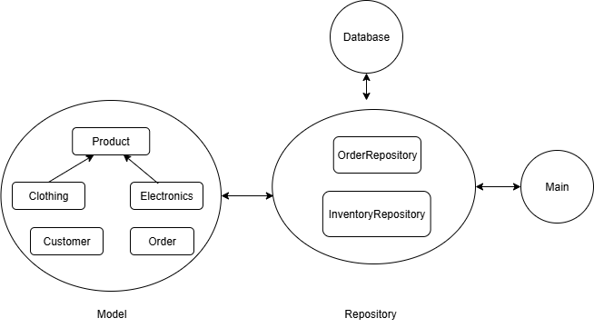

# 🛒 HỆ THỐNG QUẢN LÝ CỬA HÀNG

## Giới thiệu
Hệ thống quản lý cửa hàng được xây dựng bằng **Kotlin**, áp dụng các kiến thức từ cơ bản đến nâng cao.  
Mục tiêu: hỗ trợ **quản lý sản phẩm**, **khách hàng**, và **đơn hàng** một cách **hiệu quả**, **linh hoạt**, và **dễ mở rộng**.

## Chức năng chính

### 1. Quản lý sản phẩm
- Thêm sản phẩm (electronics, clothing)  
- Tìm kiếm sản phẩm thông qua key, loại sản phẩm
- Cập nhật số lượng kho cho từng sản phẩm và cho nhiều sản phẩm cùng lúc
- Hiển thị thông tin chi tiết sản phẩm  
- Báo cáo sản phẩm  

### 2. Quản lý khách hàng
- Thêm, chỉnh sửa và xóa thông tin khách hàng
- Xem thông tin toàn bộ khách hàng và nhóm khách hàng có lượt tiêu dùng cao nhất 
- Phân loại nhóm khách hàng  
- Gửi thông báo và ưu đãi  

### 3. Quản lý đơn hàng
- Tạo và xem chi tiết đơn hàng  
- Tìm kiếm đơn hàng thông qua key và id khách hàng
- Báo cáo doanh thu theo đơn hàng  

### 4. Phân tích & báo cáo
- Báo cáo kho  
- Báo cáo doanh thu  

## Cấu trúc dự án

```
├── com/example/summarytask12/
│ ├── controller/ # Lớp điều khiển - xử lý logic luồng người dùng
│ │ ├── CustomerController.kt # Quản lý yêu cầu liên quan khách hàng
│ │ ├── MenuController.kt # Điều hướng menu chính của ứng dụng
│ │ ├── OrderController.kt # Quản lý các thao tác với đơn hàng
│ │ ├── ProductController.kt # Quản lý các thao tác với sản phẩm
│ │ └── ReportController.kt # Xử lý yêu cầu về báo cáo, thống kê
│ │
│ ├── extension/ # Các hàm mở rộng (Extension Functions)
│ │ ├── ProductExt.kt # Hàm mở rộng cho đối tượng Product
│ │ └── StringExt.kt # Hàm mở rộng xử lý chuỗi
│ │
│ ├── model/ # Các lớp mô hình (Entities / Data Classes)
│ │ ├── customer/
│ │ │ ├── Address.kt # Lưu thông tin địa chỉ khách hàng
│ │ │ ├── Customer.kt # Định nghĩa đối tượng khách hàng
│ │ │ └── CustomerType.kt # Phân loại nhóm khách hàng
│ │ ├── discount/
│ │ │ └── DiscountContext.kt # Áp dụng giảm giá
│ │ ├── order/
│ │ │ ├── Order.kt # Định nghĩa đơn hàng
│ │ │ ├── OrderItem.kt # Sản phẩm trong đơn hàng
│ │ │ └── OrderStatus.kt # Trạng thái đơn hàng
│ │ └── product/
│ │ ├── Product.kt # Lớp cha mô tả thông tin chung của sản phẩm
│ │ ├── Electronic.kt # Sản phẩm điện tử
│ │ ├── Clothing.kt # Sản phẩm quần áo
│ │ ├── ProductCategory.kt # Phân loại sản phẩm
│ │ └── SizeClothing.kt # Thông tin kích cỡ quần áo
│ │
│ ├── repository/ # Tầng truy cập dữ liệu (Data Access Layer)
│ │ ├── CustomerRepository.kt # Lưu / truy xuất dữ liệu khách hàng
│ │ ├── OrderRepository.kt # Lưu / truy xuất đơn hàng
│ │ └── ProductRepository.kt # Lưu / truy xuất sản phẩm
│ │
│ ├── service/ # Tầng dịch vụ - xử lý nghiệp vụ chính
│ │ ├── CustomerService.kt # Xử lý logic liên quan khách hàng
│ │ ├── ProductService.kt # Xử lý logic sản phẩm
│ │ ├── OrderService.kt # Quản lý quy trình đặt hàng
│ │ ├── InventoryReport.kt # Báo cáo kho
│ │ └── SaleReport.kt # Báo cáo doanh thu
│ │
│ ├── util/ # Các tiện ích dùng chung (Utility)
│ │ ├── DatabaseConnect.kt # Kết nối cơ sở dữ liệu
│ │ ├── InputHandler.kt # Xử lý nhập dữ liệu người dùng
│ │ ├── OutputHandler.kt # Xử lý xuất dữ liệu / hiển thị kết quả
│ │ └── Reportable.kt # Interface cho các lớp có thể tạo báo cáo
│ │
│ └── StoreApplication.kt # Điểm khởi chạy chính của ứng dụng
```


## Luồng hoạt động của dự án

<p align="center">
  
</p>

- **Controller**: Nhận yêu cầu từ người dùng, điều phối các thao tác.  
- **Service**: Chứa nghiệp vụ chính, xử lý dữ liệu trung gian.  
- **Repository**: Quản lý truy cập và lưu trữ dữ liệu.  
- **Model**: Đại diện cho thực thể (Product, Customer, Order...).
- **StroreApplication**: Điểm khởi chạy chính của hệ thống.


## Kiến thức Kotlin áp dụng 

| Chủ đề | Nội dung chính |
|--------|----------------|
| **Cú pháp cơ bản** | Biến, kiểu dữ liệu, toán tử, ép kiểu, string template |
| **Điều kiện & vòng lặp** | `if-else`, `when`, `for`, `while`, `do-while` |
| **Collection** | `List`, `Set`, `Map`, các hàm `map`, `filter`, `forEach` |
| **Hàm & Lambda** | Hàm 1 dòng, tham số mặc định, `extension`, `higher-order` |
| **OOP & Null Safety** | `class`, `object`, `interface`, `data class`, `?`, `?.`, `?:`, `!!` |
| **Coroutine** | `suspend`, `launch`, `async`, `Dispatchers`, `Scope` |
| **Kotlin nâng cao** | `sealed class`, `enum`, `generics`, `reflection`, `DSL` |

## Công nghệ sử dụng
- **Ngôn ngữ:** Kotlin  
- **Paradigm:** OOP + Functional Features  
- **IDE:** IntelliJ IDEA / Android Studio  
- **Database:** SQLite (mô phỏng)  
